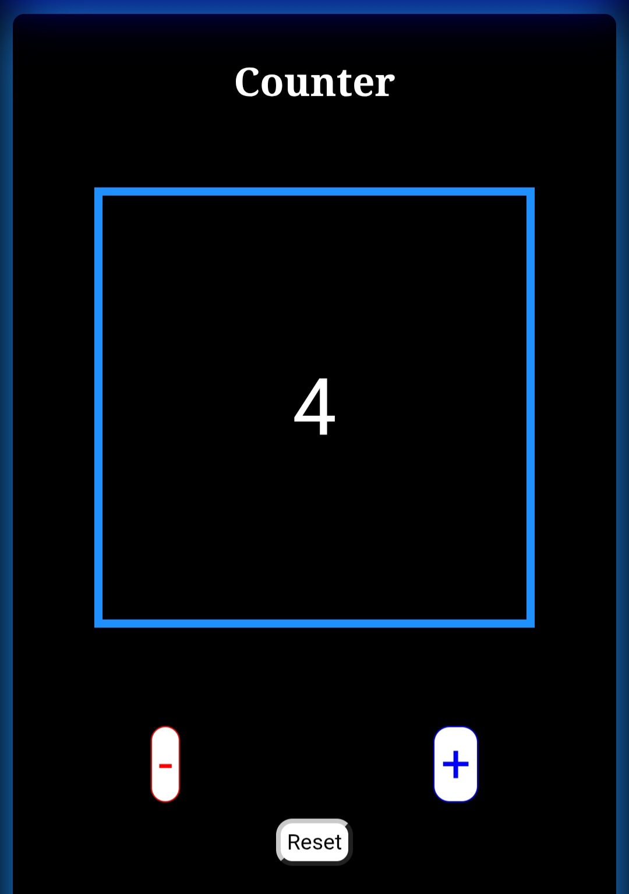
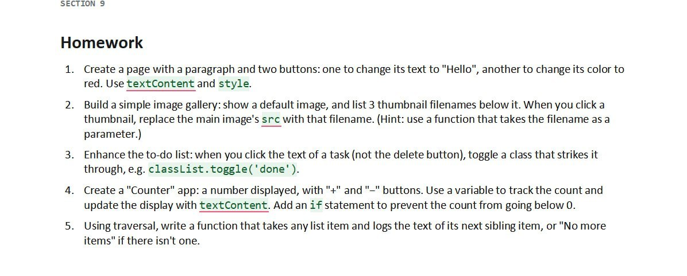

# ishubf3
(ISHub Front-end Development Bootcamp Assignment)

## Outline
This documentation has 2 parts:
1. A Website overview
2. A Website Development overview

## 1. Website Overview
### DynoDigit
A Digital Tools providing company that aims enhance the users' 
productivity by providing different digital solutions.

### Products
Currently we provide 3 main tools. 
These are 
1. Digital Counter

2. Gallery

3. Digital To Do List

## Products stage
|No.|   Name   |stage          |
|---|----------|---------------|
|1  |Counter   |Available      |
|2  |Gallery   |In-Progress    |
|3  |To do list|Available      |
> Disclaimer:  
Regarding the Gallery :  
The gallery is currently performing just to fulfill the requirements 
of the assignment as discussed below. So, it is in progress to be production
ready.

## 2. Website Development
This website is made for an assignment given by 
ISHub Front-end Development Bootcamp.

### Developer 
Amanuel Nega

### The questions

#### Image

#### Explanation: 
As shown in the image there are 5 questions 
that need different types of integration 
of **HTML*, **CSS** and **Javascript**.

#### Additional
> In addition to the questions we were given,
I asked the lecturers if we could separate
pages for different questions, and 
they told me that we could.

Therefore, I separated my pages to make the
website more advanced and to give each
question more space.(I have explained
the reason in the following sections)

### Preferences

#### Website Idea
Since we were given questions that require the 
DOM manipulation of different contents and because 
these are similar to different tools and applications 
that we use, I decided to make the website 
a **Digital Tools** website.

#### Page Separation
Bcause I found that 3 of the 5 question can be enhanced to
some kinds of tools, I made them separately. These are :

1. Gallery (Question no 2)
2. To do list (Question no 3) and
3. Counter (Question no 4).

And I included question numbers 1 and 5 to the home page as a free demo tools 
offered from the website.

#### Application Scope
Though the questions were relatively simpler, you see many things that are 
enhanced and added on the top of the assignment requirements. 

This is to make the website advanced and to not limit the tools efficiency.

This is one of the reasons for me to separate the pages. 

#### Why I separated them
- Because I the pages could be made a separate tool (As explained before)
- Because I enhanced the pages and need more space (As explained above)
- For _Separation of Concerns_ 

### Repository structure
The structure is as follows:
- ishubf3
  - index.html
  - README.md
  - pages
    - counter.js
    - gallery.js
    - todo.js 
  - assets
    - css
      - base.css
    - js
      - index.js
      - counter.js
      - gallery.js
      - todo.js
    - images
      - (Gallery images, background images and Documentation images)
